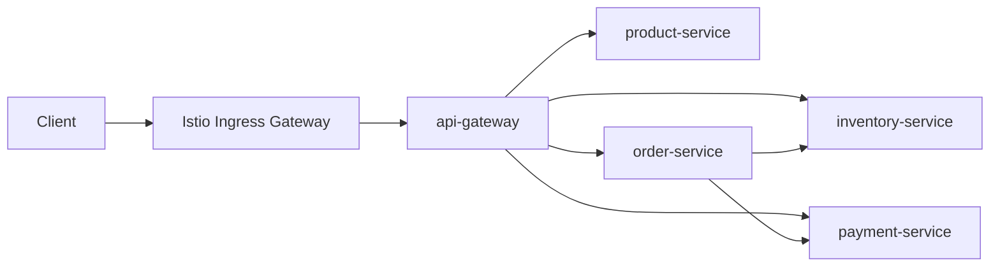

# 커머스 MSA 아키텍처

## 주문 생성 흐름

1. 클라이언트가 `POST /api/orders`를 호출한다.
2. `api-gateway`가 요청을 `order-service`로 전달한다.
3. `order-service`가 주문 라인별로 `inventory-service`에 재고 예약을 요청한다.
4. 재고 예약이 모두 성공하면 `payment-service`에 결제 승인을 요청한다.
5. 결제 실패 또는 중간 예외 발생 시 `order-service`가 예약한 재고를 해제한다.

## 운영 확장 포인트

- 인메모리 저장소를 서비스별 데이터베이스로 교체한다.
- 주문 생성 흐름은 Kafka/Outbox/Saga 기반 비동기 보상 트랜잭션으로 확장한다.
- Istio VirtualService에 canary, timeout, retry 정책을 추가한다.
- OpenTelemetry Collector를 연결해 trace와 metric을 수집한다.

