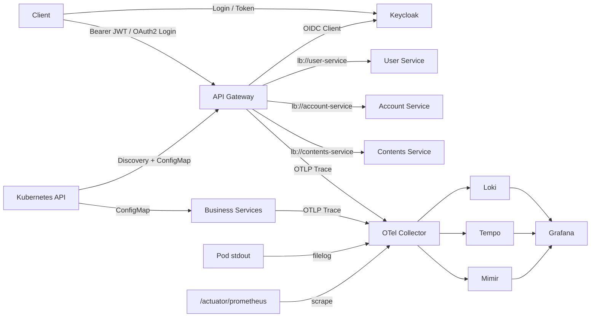

# Commerce and Finance MSA on Kubernetes

Spring Boot 3.x와 Java 21로 작성한 커머스·금융 MSA 멀티모듈 프로젝트다. API Gateway가 외부 요청을 받고 Spring Cloud Kubernetes의 `DiscoveryClient`와 Spring Cloud LoadBalancer를 통해 User, Account, Contents Service로 전달한다.

## 기술 구성

| 영역 | 구성 |
| --- | --- |
| 런타임 | Java 21, Spring Boot 3.5.16 |
| 클라우드 | Spring Cloud 2025.0.3, Spring Cloud Kubernetes |
| 진입점 | Spring Cloud Gateway Server WebFlux |
| 인증/인가 | Keycloak, OAuth2 Client, OAuth2 Resource Server, JWT role 매핑 |
| 서비스 | User Service, Account Service, Contents Service |
| 데이터 | PostgreSQL, Flyway, Redis cache/rate limit |
| 빌드 | Gradle 8.14.3 Wrapper, 공통 멀티스테이지 Dockerfile, Docker Buildx |
| 배포 | Docker 이미지 빌드·업로드, Kustomize, HPA, RBAC |
| 관측성 | Common Metrics, OpenTelemetry Collector, Loki, Grafana, Tempo, Mimir |

Spring Cloud `2025.0.x`는 Spring Boot `3.5.x`와 호환되는 공식 릴리스 트레인이다. 버전 선택 근거는 [Spring Cloud 호환 표](https://spring.io/projects/spring-cloud/)와 [Spring Cloud Kubernetes 문서](https://docs.spring.io/spring-cloud-kubernetes/reference/)에서 확인할 수 있다.

## 구조

```text
.
├── api-gateway/                  # 8080, 외부 API 라우팅과 상관관계 ID
├── user-service/                 # 8081, 회원 등록·조회
├── account-service/              # 8082, 계좌·멱등 입출금·거래 원장
├── contents-service/             # 8083, 공지사항·게시물·커서 조회
├── common-metrics/               # 공통 태그·카디널리티 제한·업무 메트릭 자동 구성
├── common-security/              # Keycloak JWT 권한 변환과 OAuth2 공통 설정
├── deploy/
│   ├── k8s/
│   │   ├── base/                 # 애플리케이션 공통 Kubernetes 리소스
│   │   ├── auth/                 # 로컬·개발용 Keycloak realm과 배포 리소스
│   │   └── overlays/local/       # 로컬 이미지·단일 복제본 오버레이
│   └── observability/            # 개발용 단일 노드 LGTM + OTel Collector
├── Dockerfile                    # 모든 실행 모듈의 공통 멀티스테이지 빌드
├── compose.yml                   # DB·Redis·전체 애플리케이션 로컬 실행
├── docs/                          # Docker 및 Kubernetes 운영 문서
├── AGENTS.md
├── PLANS.md
└── build.gradle
```



## 로컬 실행

필수 도구는 Docker Desktop 또는 Docker Engine + Compose다. 공통 Dockerfile로 네 애플리케이션을 빌드하고 PostgreSQL, Redis와 함께 실행한다.

```bash
cp .env.example .env
docker compose up -d --build --wait
docker compose ps
```

Keycloak 로컬 realm에서 access token을 발급받고 Gateway를 경유해 회원을 생성하고 조회한다.

```bash
ACCESS_TOKEN=$(
  curl -fsS -X POST 'http://localhost:8090/realms/commerce/protocol/openid-connect/token' \
    -H 'Content-Type: application/x-www-form-urlencoded' \
    --data-urlencode 'grant_type=password' \
    --data-urlencode 'client_id=commerce-cli' \
    --data-urlencode 'username=alice' \
    --data-urlencode 'password=alice-password' |
  sed -n 's/.*"access_token":"\([^"]*\)".*/\1/p'
)

curl -i -X POST http://localhost:8080/api/v1/users \
  -H "Authorization: Bearer ${ACCESS_TOKEN}" \
  -H 'Content-Type: application/json' \
  -H 'X-Correlation-Id: local-checkout-001' \
  -d '{"email":"buyer@example.com","name":"구매자"}'

curl http://localhost:8080/api/v1/users \
  -H "Authorization: Bearer ${ACCESS_TOKEN}"
```

로그와 종료:

```bash
docker compose logs -f api-gateway user-service account-service contents-service
docker compose down
```

JDK 21로 애플리케이션을 직접 실행할 때는 PostgreSQL과 Redis만 Compose로 시작한다.

```bash
docker compose up -d --wait postgresql redis
JAVA_HOME=$(/usr/libexec/java_home -v 21) ./gradlew :user-service:bootRun
```

User Service는 PostgreSQL을 원본 저장소로 사용하고 Redis에 회원 단건 조회 결과를 10분간 캐시한다. 인증/인가 구성은 [Keycloak 인증/인가 가이드](docs/AUTHENTICATION.md), 금융 API와 정합성 정책은 [금융 서비스 가이드](docs/FINANCE_SERVICES.md), 데이터 구성은 [데이터 인프라 가이드](docs/DATA_INFRASTRUCTURE.md)를 참고한다.

## 컨테이너와 Kubernetes

상세 배포·점검·롤백·장애 대응 절차는 [Kubernetes 운영 가이드](docs/K8S_OPERATIONS.md)를 참고한다.
모듈별 버전과 환경별 이미지 빌드·업로드 정책은 [Docker 이미지 가이드](docs/DOCKER_BUILD_GUIDE.md)를 참고한다.

공통 Dockerfile과 Docker Buildx로 이미지를 로컬 Docker daemon에 적재한다.

```bash
./gradlew dockerBuildAll \
  -PtargetEnvironment=local \
  -PimageRegistry=commerce \
  -PimageTag=local
```

Registry로 빌드·전송할 때는 인증을 먼저 구성한 뒤 실행한다.

```bash
./gradlew dockerPushAll \
  -PtargetEnvironment=dev \
  -PimageRegistry=registry.example.com/commerce \
  -PimageTag="0.1.0-dev.$(git rev-parse --short=12 HEAD)" \
  -PdockerArchitecture=amd64
```

Java 21 JDK/JRE 기반 이미지는 재현 가능한 빌드를 위해 digest로 고정되어 있다. Docker Buildx는 로컬 호스트 아키텍처를 자동 선택하고 Registry 빌드는 Kubernetes 노드 아키텍처를 `-PdockerArchitecture`로 명시한다.

kind를 사용하는 경우 이미지를 클러스터에 적재한다.

```bash
kind load docker-image \
  commerce/api-gateway:local \
  commerce/user-service:local \
  commerce/account-service:local \
  commerce/contents-service:local
```

LGTM 스택과 애플리케이션을 순서대로 배포한다.

```bash
kubectl kustomize deploy/observability >/dev/null
kubectl kustomize deploy/k8s/overlays/local >/dev/null
kubectl apply -k deploy/observability
kubectl -n observability rollout status deployment/loki
kubectl -n observability rollout status deployment/tempo
kubectl -n observability rollout status deployment/mimir
kubectl apply -k deploy/k8s/overlays/local
kubectl -n commerce rollout status statefulset/postgresql
kubectl -n commerce rollout status statefulset/redis
kubectl -n commerce rollout status deployment/keycloak
kubectl -n commerce rollout status deployment/user-service
kubectl -n commerce rollout status deployment/account-service
kubectl -n commerce rollout status deployment/contents-service
kubectl -n commerce rollout status deployment/api-gateway
```

Ingress Controller가 없다면 포트 포워딩으로 API를 확인한다.

```bash
kubectl -n commerce port-forward service/api-gateway 8080:80
kubectl -n commerce port-forward service/keycloak 8090:8080
```

`commerce.local` Ingress를 사용할 경우 NGINX Ingress Controller와 로컬 DNS 또는 `/etc/hosts` 설정이 필요하다.

## 관측성 확인

Grafana를 로컬 3000 포트로 연결한다.

```bash
kubectl -n observability port-forward service/grafana 3000:3000
```

브라우저에서 `http://localhost:3000`을 열면 익명 Viewer로 접속된다. `Commerce MSA Overview` 대시보드와 Explore에서 다음 데이터를 확인할 수 있다.

- Mimir: Actuator의 Prometheus 메트릭
- Tempo: Micrometer Tracing이 전송한 분산 트레이스
- Loki: Kubernetes Pod의 ECS JSON 표준 출력 로그

Collector는 Grafana 공식 권장 방식대로 로그를 Loki OTLP HTTP 엔드포인트로, 트레이스를 Tempo OTLP 엔드포인트로 전달한다. 관련 세부사항은 [Loki OTLP 수집 문서](https://grafana.com/docs/loki/latest/send-data/otel/)와 [Tempo Collector 문서](https://grafana.com/docs/tempo/latest/set-up-for-tracing/instrument-send/set-up-collector/)를 참고한다.

`common-metrics`는 서비스명·환경 공통 태그와 업무 처리율·실패율·처리시간을 표준화한다. 메트릭 이름, 애너테이션 사용법, PromQL은 [공통 메트릭 운영 가이드](docs/METRICS.md)를 따른다.

## 운영 전환 시 보완사항

`deploy/observability`는 로컬·개발 클러스터용 단일 인스턴스이며 `emptyDir`를 사용한다. 운영에서는 Grafana가 제공하는 Helm Chart로 LGTM을 분산 배포하고 객체 스토리지, PVC, 인증, TLS, 보존 기간, 테넌트 격리를 구성해야 한다. 애플리케이션도 다음 항목을 환경에 맞게 추가해야 한다.

- Staging/Production의 Managed PostgreSQL·Redis endpoint와 외부 Secret
- 서비스별 DB 계정과 계좌 원장 PITR·감사·복구 훈련
- 실제 OIDC issuer와 TLS 인증서
- 외부 Keycloak 또는 IdP 운영, Gateway OAuth2 client secret 관리
- 이미지 레지스트리 인증과 이미지 서명
- Zone 기반 topology spread
- 실제 트래픽에 맞춘 trace sampling과 리소스/HPA 기준
