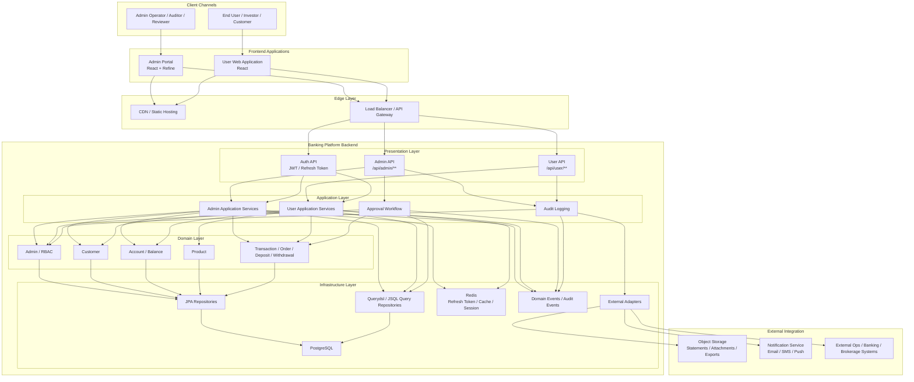

# System Architecture

## 예상 완료 아키텍처

## 설명
- `admin portal`과 `user web application`은 별도 프론트엔드 앱으로 운영한다.
- 백엔드는 하나의 Spring Boot 서비스로 시작하되 `admin API`와 `user API` 경계를 분리한다.
- PostgreSQL은 계정, 계좌, 거래, 승인, 감사 로그의 주 데이터 저장소로 사용한다.
- Redis는 Refresh Token, 인증 세션성 데이터, 캐시 저장소로 사용한다.
- 관리자 기능은 RBAC, 승인 워크플로우, 감사 로그를 중심으로 설계한다.
- 사용자 기능은 본인 데이터 조회와 요청 흐름에 집중한다.
- 조회 성능이 중요한 리스트와 집계는 Querydsl / JSQL 전용 리포지토리로 분리한다.
- 외부 알림, 파일 저장, 뱅킹 / 증권 연계는 어댑터 계층에서 분리한다.

## 구현 시 참고 원칙
- 초기에는 모듈형 모놀리스로 구현하고, 이후 필요시 API 또는 모듈 단위 분리를 검토한다.
- `admin API`와 `user API`는 URL, 인증 필터, 응답 DTO, 권한 정책을 분리한다.
- PostgreSQL 트랜잭션 정합성과 Redis TTL 정책을 함께 설계한다.
- 모든 민감 관리자 액션은 Audit 이벤트로 남긴다.
- 고객 개인정보와 계좌 / 거래 식별자는 마스킹 정책을 기본 적용한다.
