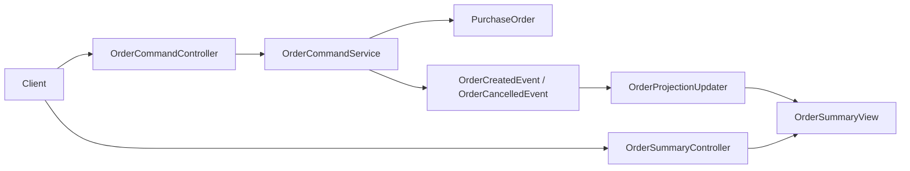

# sample_cqrs

명령 처리 모델과 조회 모델을 분리한 CQRS 샘플이다. 주문 접수는 쓰기 모델에서 처리하고, 도메인 이벤트를 통해 읽기 전용 프로젝션을 갱신한다.

## 목적

- 명령 모델과 조회 모델 분리 구조 예시 제공
- 이벤트 기반 조회 프로젝션 반영 흐름 설명
- 운영에서 자주 보는 주문 대시보드형 조회 API 예시 제공

## 기술 스택

- Java 21
- Spring Boot 3.4.3
- Spring Web MVC
- Spring Data JPA
- H2
- Gradle

## 주요 기능

- `POST /api/orders` 명령 API
- 주문 취소 명령 API
- 주문 조회 프로젝션(`OrderSummaryView`) 별도 관리
- 최근 주문 목록과 고객별 조회 API
- 통합 테스트로 명령 후 조회 모델 갱신 검증

## 아키텍처

이 샘플은 쓰기 경로와 읽기 경로를 코드 구조와 데이터 접근 관점에서 분리한다.

### 구성 요소

- `command`
  - 주문 생성, 취소 같은 상태 변경 책임을 가진다.
  - `PurchaseOrder` 애그리게이트와 `PurchaseOrderRepository`를 사용한다.
  - `OrderCommandService`가 비즈니스 규칙과 이벤트 발행을 담당한다.
- `events`
  - 쓰기 모델에서 발생한 도메인 이벤트를 정의한다.
  - 현재는 `OrderCreatedEvent`, `OrderCancelledEvent`를 사용한다.
- `query`
  - 조회 전용 모델인 `OrderSummaryView`를 관리한다.
  - API는 이 프로젝션만 조회하며, 쓰기 테이블을 직접 조회하지 않는다.
  - `OrderProjectionUpdater`가 이벤트를 받아 조회 모델을 갱신한다.
- `common`
  - 예외 응답과 공통 API 오류 형식을 제공한다.

### 구조 요약



### 왜 이렇게 분리했는가

- 명령 모델은 상태 변경과 규칙 검증에 집중한다.
- 조회 모델은 화면/리포트/대시보드에 맞춘 형태로 단순하게 유지한다.
- 읽기 API가 복잡해져도 쓰기 모델을 오염시키지 않는다.
- 나중에 읽기 모델을 Elasticsearch, Redis, 별도 DB로 바꾸는 확장 포인트가 생긴다.

## 상세 처리 흐름

1. 명령 서비스가 주문 애그리게이트를 저장한다.
2. 같은 트랜잭션 안에서 도메인 이벤트를 발행한다.
3. 이벤트 핸들러가 읽기 모델 프로젝션을 갱신한다.
4. 조회 API는 쓰기 모델이 아닌 프로젝션 테이블만 조회한다.

### 생성 시퀀스

1. `OrderCommandController`가 요청 검증을 수행한다.
2. `OrderCommandService`가 `PurchaseOrder`를 저장한다.
3. 서비스가 `OrderCreatedEvent`를 발행한다.
4. `OrderProjectionUpdater`가 `OrderSummaryView`를 생성한다.
5. `OrderSummaryController`는 이후 조회 요청에서 프로젝션만 반환한다.

### 취소 시퀀스

1. `OrderCommandService`가 주문을 조회하고 상태를 `CANCELLED`로 변경한다.
2. `OrderCancelledEvent`를 발행한다.
3. `OrderProjectionUpdater`가 기존 `OrderSummaryView` 상태를 함께 갱신한다.

## 운영 관점 포인트

- 현재 구현은 동일 애플리케이션 내부 이벤트를 사용하므로 구조 이해에 집중하기 좋다.
- 실무에서는 조회 모델 갱신을 비동기 메시지로 분리해 eventual consistency를 더 명확히 가져갈 수 있다.
- 조회 모델은 화면 요구사항에 따라 자유롭게 비정규화할 수 있다.
- 명령 API와 조회 API의 확장 속도가 다를 때 CQRS의 장점이 커진다.

## 실행

```bash
cd /Users/revy/workspace_codex/spring_sample/sample_cqrs
./gradlew bootRun
```

## API 예제

### 주문 생성

```bash
curl -X POST http://localhost:8080/api/orders \
  -H 'Content-Type: application/json' \
  -d '{
    "customerId": "CUST-100",
    "productCode": "MONITOR-32",
    "quantity": 2,
    "unitPrice": 320000
  }'
```

### 최근 주문 조회

```bash
curl http://localhost:8080/api/order-summaries
```

### 주문 취소

```bash
curl -X POST http://localhost:8080/api/orders/{orderId}/cancel
```

## 테스트

```bash
cd /Users/revy/workspace_codex/spring_sample/sample_cqrs
./gradlew test
```

## 관련 링크

- CQRS 패턴 소개: [Martin Fowler - CQRS](https://martinfowler.com/bliki/CQRS.html)
- Spring Data JPA 레퍼런스: [Spring Data JPA Reference](https://docs.spring.io/spring-data/jpa/reference/)
- Spring 트랜잭션 이벤트: [Spring Framework Transaction-bound Events](https://docs.spring.io/spring-framework/reference/data-access/transaction/event.html)
