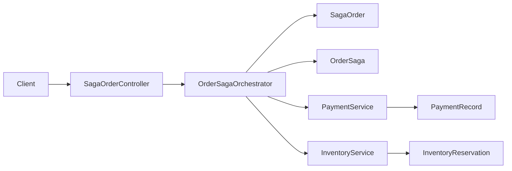

# sample_saga

주문 처리 과정을 Saga 오케스트레이션으로 연결한 샘플이다. 주문 접수 후 결제 승인과 재고 예약을 순차적으로 수행하고, 실패 시 이전 단계를 보상한다.

## 목적

- 분산 트랜잭션 대신 Saga 오케스트레이션 흐름 예시 제공
- 단계별 상태 전이와 보상 트랜잭션 구조 설명
- 운영 시 확인할 수 있는 Saga 상태 조회 API 제공

## 기술 스택

- Java 21
- Spring Boot 3.4.3
- Spring Web MVC
- Spring Data JPA
- PostgreSQL
- Gradle

## 주요 기능

- 주문 생성과 Saga 시작
- 결제 승인/실패 시뮬레이션
- 재고 예약/실패 시뮬레이션
- 재고 실패 시 결제 취소 보상 처리
- 주문/Saga 상태 조회 API

## 아키텍처

이 샘플은 오케스트레이션 기반 Saga를 단일 애플리케이션 안에서 표현한다. 실제 분산 시스템처럼 서비스별 DB를 나누지는 않았지만, 단계별 로컬 트랜잭션과 보상 트랜잭션의 책임을 코드 단위로 분리했다.

### 구성 요소

- `order`
  - 주문 엔티티 `SagaOrder`와 주문 조회 API를 담당한다.
  - 주문은 Saga 전체의 비즈니스 결과를 나타낸다.
- `saga`
  - `OrderSaga`가 오케스트레이션 상태를 관리한다.
  - `OrderSagaOrchestrator`가 각 단계를 어떤 순서로 실행할지 결정한다.
- `payment`
  - 결제 승인과 결제 취소 보상 책임을 가진다.
  - 결제 실패는 `FAIL-PAYMENT` 고객 ID로 시뮬레이션한다.
- `inventory`
  - 재고 예약 책임을 가진다.
  - 재고 실패는 `LIMITED-STOCK` 상품 코드로 시뮬레이션한다.

### 구조 요약



### 왜 오케스트레이션 방식을 택했는가

- 흐름 제어 지점이 한 곳에 있어 학습용 예제로 이해하기 쉽다.
- 어떤 단계에서 실패했고 어떤 보상이 수행됐는지 추적하기 쉽다.
- 외부 시스템 연동 전에도 상태 전이 모델을 검증할 수 있다.

## 상세 처리 흐름

1. 주문 생성 시 Saga 인스턴스를 `STARTED` 상태로 저장한다.
2. 오케스트레이터가 결제를 시도한다.
3. 결제가 성공하면 재고 예약을 시도한다.
4. 재고 예약이 실패하면 결제를 취소하고 Saga를 `COMPENSATED`로 종료한다.
5. 모든 단계가 성공하면 주문을 `COMPLETED`, Saga를 `COMPLETED`로 종료한다.

### 성공 시퀀스

1. API가 주문 생성 요청을 받는다.
2. `OrderSagaOrchestrator`가 `SagaOrder`, `OrderSaga`를 함께 생성한다.
3. `PaymentService`가 결제를 승인한다.
4. `InventoryService`가 재고를 예약한다.
5. 주문과 Saga를 모두 `COMPLETED`로 변경한다.

### 실패 및 보상 시퀀스

#### 결제 실패

1. 결제 단계에서 예외가 발생한다.
2. 재고 단계는 실행하지 않는다.
3. 주문은 `FAILED`, Saga는 `FAILED` 상태가 된다.

#### 재고 실패

1. 결제는 성공해 결제 레코드가 생성된다.
2. 재고 예약에서 예외가 발생한다.
3. 오케스트레이터가 `PaymentService.cancelPayment()`를 호출한다.
4. 주문은 `COMPENSATED`, Saga는 `COMPENSATED` 상태가 된다.

## 상태 모델

### 주문 상태

- `PENDING`: Saga 진행 중
- `COMPLETED`: 모든 단계 성공
- `FAILED`: 선행 단계에서 실패했고 보상할 대상이 없음
- `COMPENSATED`: 일부 단계 성공 후 후속 단계 실패로 보상 완료

### Saga 상태

- `STARTED`
- `PAYMENT_COMPLETED`
- `INVENTORY_RESERVED`
- `COMPLETED`
- `FAILED`
- `COMPENSATED`

## 운영 관점 포인트

- Saga는 ACID 분산 트랜잭션 대체 수단이지 완전한 원자성을 제공하지 않는다.
- 보상은 rollback이 아니라 별도 비즈니스 동작이다. 그래서 취소 API/취소 로그/멱등성이 중요하다.
- 단계별 상태 저장이 있어야 운영에서 장애 지점과 보상 여부를 추적할 수 있다.
- 실무에서는 단계 서비스들이 메시지 기반 비동기 통신으로 분리되는 경우가 많다.

## 실행

### 1. PostgreSQL 실행

```bash
cd /Users/revy/workspace_codex/spring_sample/sample_saga
docker compose up -d
```

- PostgreSQL 포트: `5435`
- DB 이름: `sample_saga`
- 사용자: `sample_user`
- 비밀번호: `sample_pass`

### 2. 애플리케이션 실행

```bash
cd /Users/revy/workspace_codex/spring_sample/sample_saga
./gradlew bootRun
```

- 애플리케이션 포트: `8082`

환경 변수로 접속 속성을 덮어쓸 수 있다.

- `DB_HOST`
- `DB_PORT`
- `DB_NAME`
- `DB_USERNAME`
- `DB_PASSWORD`

## 샘플 데이터

애플리케이션 시작 시 데이터가 비어 있으면 아래 시나리오가 자동 생성된다.

- 성공 주문 1건
- 결제 실패 주문 1건
- 재고 실패 후 보상된 주문 1건

## 통합 실행

```bash
cd /Users/revy/workspace_codex/spring_sample
./scripts/patterns-all-start.sh
```

## API 예제

### 성공 케이스

```bash
curl -X POST http://localhost:8080/api/saga/orders \
  -H 'Content-Type: application/json' \
  -d '{
    "customerId": "CUST-500",
    "productCode": "CHAIR-01",
    "quantity": 2,
    "unitPrice": 89000
  }'
```

### 결제 실패 시뮬레이션

```bash
curl -X POST http://localhost:8080/api/saga/orders \
  -H 'Content-Type: application/json' \
  -d '{
    "customerId": "FAIL-PAYMENT",
    "productCode": "CHAIR-01",
    "quantity": 2,
    "unitPrice": 89000
  }'
```

### 재고 실패 시뮬레이션

```bash
curl -X POST http://localhost:8080/api/saga/orders \
  -H 'Content-Type: application/json' \
  -d '{
    "customerId": "CUST-500",
    "productCode": "LIMITED-STOCK",
    "quantity": 2,
    "unitPrice": 89000
  }'
```

## 테스트

```bash
cd /Users/revy/workspace_codex/spring_sample/sample_saga
./gradlew test
```

## 관련 링크

- Saga 패턴 설명: [microservices.io - Saga Pattern](https://microservices.io/patterns/data/saga.html)
- Spring Data JPA 레퍼런스: [Spring Data JPA Reference](https://docs.spring.io/spring-data/jpa/reference/)
- 보상 트랜잭션이 필요한 배경: [microservices.io - A pattern language for microservices](https://microservices.io/patterns/index)
