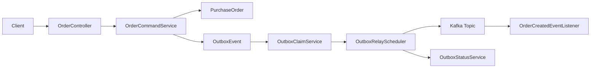

# Transactional Outbox 샘플

Spring Boot, JPA, Kafka를 사용해 Transactional Outbox 패턴을 구현한 예제다. 주문 생성 시 주문 테이블과 아웃박스 테이블을 하나의 로컬 트랜잭션으로 저장하고, 별도 릴레이 스케줄러가 아웃박스 이벤트를 Kafka로 발행한다.

## 아키텍처

이 샘플은 데이터베이스 변경과 메시지 발행 사이의 불일치를 줄이기 위해 Transactional Outbox 패턴을 사용한다. 핵심은 "비즈니스 데이터 저장"과 "발행할 메시지 저장"을 하나의 DB 트랜잭션으로 묶고, 실제 Kafka 발행은 별도 릴레이가 담당하는 점이다.

### 구성 요소

- `order`
  - 주문 생성 API와 주문 도메인 엔티티를 담당한다.
  - `OrderCommandService`가 주문 저장과 아웃박스 적재를 함께 수행한다.
- `outbox`
  - `OutboxEvent` 테이블이 발행 대상 메시지를 보관한다.
  - `OutboxClaimService`가 발행 대상 이벤트를 선점한다.
  - `OutboxStatusService`가 성공/실패 상태를 갱신한다.
  - `OutboxRelayScheduler`가 주기적으로 릴레이를 수행한다.
- `messaging`
  - Kafka에 전달할 이벤트 스키마와 샘플 소비 리스너를 제공한다.
- `config`
  - 토픽 이름, 릴레이 주기, 재시도 backoff 같은 운영 설정을 분리한다.

### 구조 요약



### 왜 Outbox가 필요한가

- DB 트랜잭션 안에서 Kafka 발행을 직접 보장하기 어렵다.
- DB는 커밋됐는데 메시지 발행이 실패하면 데이터 불일치가 생긴다.
- 메시지는 발행됐는데 DB가 롤백되면 소비자 기준으로 유령 이벤트가 된다.
- Outbox는 이 문제를 "DB 커밋 성공 시 메시지 저장까지 보장"하는 방식으로 완화한다.

## 상세 흐름

1. `POST /api/orders` 요청이 들어오면 주문 엔티티와 아웃박스 이벤트를 같은 트랜잭션으로 저장한다.
2. `OutboxRelayScheduler`가 발행 대기 상태 아웃박스 레코드를 배치 단위로 선점한다.
3. 선점된 이벤트를 Kafka 토픽으로 발행하고 성공 시 `PUBLISHED`, 실패 시 재시도 가능하도록 `PENDING` 상태로 되돌린다.
4. `GET /api/outbox-events`로 발행 상태를 운영 관점에서 확인할 수 있다.

### 저장 단계

1. API가 주문 생성 요청을 받는다.
2. `OrderCommandService`가 `PurchaseOrder`를 저장한다.
3. 같은 트랜잭션 안에서 `OrderCreatedEvent`를 JSON으로 직렬화해 `OutboxEvent`에 저장한다.
4. 트랜잭션이 커밋되면 주문 데이터와 발행 대상 메시지가 함께 보존된다.

### 릴레이 단계

1. 스케줄러가 `PENDING` 상태이면서 재시도 가능 시각이 지난 이벤트를 조회한다.
2. 이벤트를 `PROCESSING`으로 바꾸고 Kafka 발행을 시도한다.
3. 발행 성공 시 `PUBLISHED`와 `publishedAt`을 기록한다.
4. 실패 시 `attemptCount`, `lastErrorMessage`, `nextAttemptAt`을 갱신해 재시도한다.

## 상태 모델

- `PENDING`: 아직 발행되지 않았거나 재시도 대기 중
- `PROCESSING`: 현재 릴레이가 선점해 발행 시도 중
- `PUBLISHED`: Kafka 발행 완료

## 운영 관점 포인트

- 현재 구현은 polling publisher 방식이다.
- 발행 중복 가능성이 있으므로 소비자는 멱등성을 고려해야 한다.
- 배치 크기, 재시도 간격, 타임아웃은 운영 설정으로 분리했다.
- 실무에서는 Outbox 테이블 인덱스, 보관 정책, 파티션 전략, 장애 알림도 함께 설계해야 한다.

## 기술 포인트

- Spring Boot 3.4.3
- Spring Data JPA + PostgreSQL
- Spring for Apache Kafka
- `@Scheduled` 기반 Outbox Relay
- 재시도 backoff, 시도 횟수, 마지막 오류 메시지 저장
- `spring-kafka-test` 기반 통합 테스트

## 실행 방법

### 1. PostgreSQL + Kafka 실행

```bash
cd /Users/revy/workspace_codex/spring_sample/transactional_outbox
docker compose up -d
```

- PostgreSQL 포트: `5436`
- DB 이름: `transactional_outbox`
- 사용자: `sample_user`
- 비밀번호: `sample_pass`
- Kafka 주소: `localhost:9092`

### 2. 애플리케이션 실행

```bash
cd /Users/revy/workspace_codex/spring_sample/transactional_outbox
./gradlew bootRun
```

- 애플리케이션 포트: `8083`

환경 변수로 접속 속성을 덮어쓸 수 있다.

- `DB_HOST`
- `DB_PORT`
- `DB_NAME`
- `DB_USERNAME`
- `DB_PASSWORD`
- `KAFKA_BOOTSTRAP_SERVERS`

## 샘플 데이터

애플리케이션 시작 시 데이터가 비어 있으면 주문 3건과 대응되는 Outbox 이벤트가 자동 생성된다.

## 통합 실행

```bash
cd /Users/revy/workspace_codex/spring_sample
./scripts/patterns-all-start.sh
```

### 3. 주문 생성 호출

```bash
curl -X POST http://localhost:8080/api/orders \
  -H 'Content-Type: application/json' \
  -d '{
    "customerId": "CUST-100",
    "productId": "SKU-OUTBOX-1",
    "quantity": 2,
    "unitPrice": 129000
  }'
```

### 4. 아웃박스 상태 확인

```bash
curl http://localhost:8080/api/outbox-events
```

## 테스트

```bash
cd /Users/revy/workspace_codex/spring_sample/transactional_outbox
./gradlew test
```

## 패키지 구조

- `order`: 주문 API, 애플리케이션 서비스, 도메인 엔티티
- `outbox`: 아웃박스 엔티티, 조회/상태 전이, 릴레이 처리
- `messaging`: Kafka 이벤트 스키마와 리스너
- `config`: Kafka 토픽, 릴레이 설정

## 참고

- PostgreSQL 기준으로 동작하며 로컬 실행용 컨테이너는 `docker compose down -v` 시 데이터가 함께 삭제된다.
- 실무에서는 Outbox Relay를 별도 프로세스로 분리하거나 Debezium CDC로 확장할 수 있다.

## 관련 링크

- Transactional Outbox 패턴: [microservices.io - Transactional Outbox](https://microservices.io/patterns/data/transactional-outbox)
- Polling Publisher 패턴: [microservices.io - Polling Publisher](https://microservices.io/patterns/data/polling-publisher.html)
- Spring for Apache Kafka 레퍼런스: [Spring Kafka Reference](https://docs.spring.io/spring-kafka/reference/reference.html)
- Spring Data JPA 레퍼런스: [Spring Data JPA Reference](https://docs.spring.io/spring-data/jpa/reference/)
