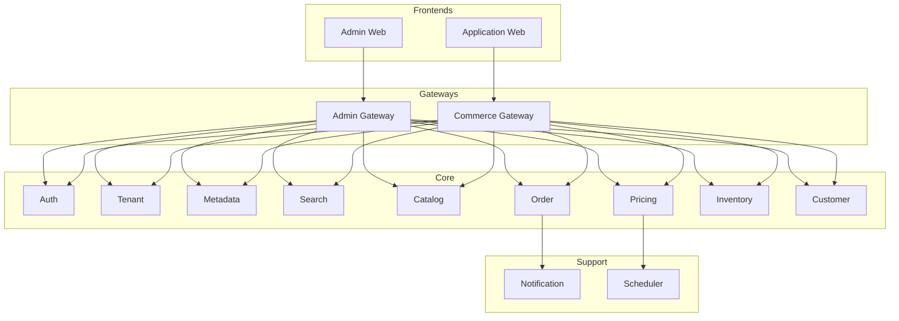

# Commerce MSA Architecture

이 문서는 제공된 이미지 기준의 **Admin / Application 공유 구조**를 텍스트로 정리한 것입니다.

## 개요
- Admin Web과 Application(Web/App)은 **서로 다른 게이트웨이**(Admin Gateway / Commerce Gateway)를 통해 접근합니다.
- 공통 서비스(Auth, Tenant, Metadata, Search 등)는 **두 애플리케이션이 함께 사용**합니다.
- 도메인 서비스는 **각자 DB 소유** + API/Event로 연결합니다.

## 상위 구성
- Gateways
  - `gateway-admin`: Admin 전용 라우팅, Admin 정책
  - `gateway-commerce`: Application 전용 라우팅, BFF 정책
- Frontends
  - `frontend/admin`: 통합 어드민 UI
  - `frontend/application`: 커머스 스토어프론트
- Core Services
  - `service-auth`, `service-tenant`, `service-metadata`, `service-search` (공통)
  - `service-catalog`, `service-order`, `service-pricing`, `service-inventory`, `service-customer`
- Supporting
  - `service-notification`, `service-scheduler`

## Mermaid

## 공유 원칙
- Auth는 **토큰 표준/권한 모델**을 단일화
- Tenant는 **멀티테넌시 규칙**과 라우팅 키를 제공
- Metadata는 **공통 스키마/확장 필드** 정의
- Search는 **Catalog/Content 이벤트**로 인덱싱

## Admin vs Application
- Admin은 데이터 변경 비중이 높고 권한이 강함
- Application은 조회/구매 트래픽이 높아 캐시/BFF 전략 필요
